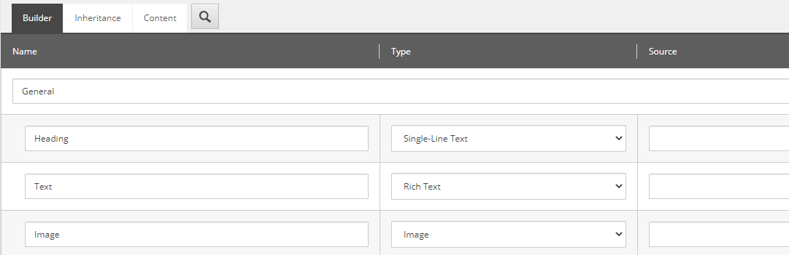

Finally! Components! About time!

But first (oh come on...), let's talk about the kind of components you can create with the Sitecore ASP.NET Core SDK.

For the examples below, we'll be creating a component that takes in a datasource with a template that has the following fields:

| Name    | Type               |
| ------- | ------------------ |
| Heading | `Single-Line Text` |
| Text    | `Rich Text`        |
| Image   | `Image`            |



## Partial View

These are like model-less view renderings in old-school Sitecore MVC. They don't have a defined model or anything, just a `.cshtml` view file. In fact, you have to throw some C# code in your Razor view _\*\*dry heave\*\*_ to fetch the fields to bind your view to. Here's the above component as a partial view:

```csharp
/* ~/Views/Default/MyPartialView.cshtml */

@{
	var heading = this.SitecoreRoute().ReadField<TextField>("Heading");
	var image = this.SitecoreRoute().ReadField<ImageField>("Image");
	var text = this.SitecoreRoute().ReadField<RichTextField>("Text");
}

<h1 asp-for="@heading"></h1>
<sc-img asp-for="@image"></sc-img>
<sc-text asp-for="@text"></sc-text>
```

and registered like this:

```csharp
services.AddSitecoreRenderingEngine(options =>
{
  options.AddPartialView("MyPartialView")
});
```

Note that your `.cshtml` file needs to be in the folder name of whatever controller you've registered as your endpoint, that is, if you've got a `DefaultController` as your endpoint then it needs to be in the `/Views/Default` folder.

You can inline the C# code in the `asp-for` if you want but it's much more readable this way. Either way, you've got your peanut butter in your chocolate and it's just too much for some people (like me). These are useful for those structural renderings that are just some placeholders in some container HTML elements and components that you can avoid needing any C# code.

## Model-Bound View

These are more similar to controller renderings with classic Sitecore MVC but without the controller (or a view rendering with a custom view model). You can create a model class that the SDK binds the data to and use that model as the model for your view. Pretty straightforward. Here's that same component from above as a model-bound view:

```csharp
public class MyModelBoundViewModel
{
  public TextField Heading { get; set; }
  public RichTextField Text { get; set; }
  public ImageField Image { get; set; }
}
```

```csharp
/* ~/Views/Shared/Components/SitecoreComponent/MyModelBoundView.cshtml */

@model MyModelBoundViewModel

<h1 asp-for="@Model.Heading"></h1>
<sc-img asp-for="@Model.Image"></sc-img>
<sc-text asp-for="@Model.Text"></sc-text>
```

and registered like this:

```csharp
services.AddSitecoreRenderingEngine(options =>
{
  options.AddModelBoundView<MyModelBoundViewModel>("MyModelBoundView")
});
```

Note that the view lives in a very specific path: `/Views/Shared/Components/SitecoreComponent`. The name of your view file (in this case, `MyComponent`) is the name you'll need to register your component as.

At the core of this, the SDK does the underlying work for you to bind your model class and wire up any other basic logic. These are useful for basic Sitecore take-this-data-from-an-item-and-display-it-on-the-page type of components.

## View Components

These are new to .NET Core and give you the most flexibility in controlling the logic. Instead of a controller, a `ViewComponent` class is created that executes an `InvokeAsync` method that is responsible for binding the model to the view. This is going to be your equivalent of a Sitecore MVC controller rendering, that is, this is the type of component where you'd be able to control some logic before sending that model to the page.

In fact, the `Model-Bound View` component from above is just a view component with a default Sitecore view component class similar to how Sitecore MVC view renderings had a default Sitecore controller doing the work behind the scenes.

```csharp
public class MyComponentViewComponent : BindingViewComponent
{
  public MyComponentViewComponent(IViewModelBinder binder) : base(binder)
  {
  }

  public async Task<IViewComponentResult> InvokeAsync(int maxPriority, bool isDone)
  {
    return await BindView<MyComponentViewModel>().ConfigureAwait(false);
  }
}
```

```csharp
public class MyViewComponentViewModel
{
  public TextField Heading { get; set; }
  public RichTextField Text { get; set; }
  public ImageField Image { get; set; }
}
```

```csharp
/* ~/Views/Shared/Components/MyViewComponent/Default.cshtml */

@model MyViewComponentViewModel

<h1 asp-for="@Model.Heading"></h1>
<sc-img asp-for="@Model.Image"></sc-img>
<sc-text asp-for="@Model.Text"></sc-text>
```

and registered like this:

```csharp
services.AddSitecoreRenderingEngine(options =>
{
  options.AddViewComponent("MyViewComponent")
});
```

Your custom logic would occur in the `InvokeAsync` method of your view component - you can override some of the binding methods to do what you need to do, however, if you're just interacting with Sitecore, a model-bound view component is probably your best bet as you can modify the shape of the data going to your component with a content resolver. These view components would be great for things like standalone components for search or for some 3rd party integration.
