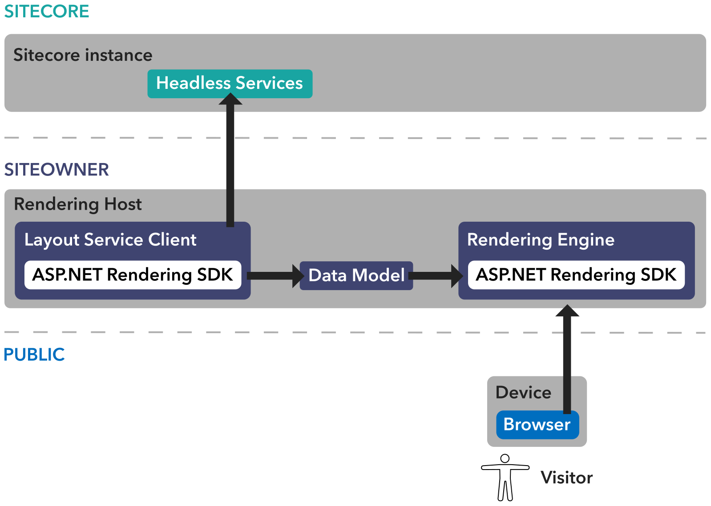

With Sitecore 10, Sitecore has introduced [Sitecore Headless Services](https://doc.sitecore.com/developers/100/developer-tools/en/sitecore-headless-services.html) (the artist formerly known as JSS Server Components) as a new means to do Sitecore development in a decoupled fashion. Whereas previously JSS only supported JavaScript frameworks such as React, Vue, and Angular, the rename from JSS Server Components to Sitecore Headless Services is due to the fact that it expands on what was there for JSS and brings along capabilities for ASP.NET Core development as well - and potentially other languages or frameworks down the road.

## What is headless development for Sitecore?

Headless development follows a decoupled architecture of the rendering application from the data application. Whereas traditional Sitecore development has been contingent on deploying code and custom components directly to the Sitecore server, headless development allows for the actual rendering of the display to be hosted separately, and in many cases using a completely separate technology. Sitecore calls this display application the _rendering host_ for the Sitecore application and ingests the data obtained from the [Sitecore Layout Service](https://doc.sitecore.com/developers/100/developer-tools/en/sitecore-layout-service.html). The Sitecore Layout Service is an API endpoint that exposes the requested item as JSON to be rendered by the rendering host. This works in conjunction with the [Sitecore Rendering Engine](https://doc.sitecore.com/developers/100/developer-tools/en/sitecore-rendering-engine.html) that is included as part of the [ASP.NET Rendering SDK](https://doc.sitecore.com/resources/sitecore-asp-dot-net-rendering-sdk/api/index.html) to display the proper fields and render the components appropriately.

Here's a shamelessly stolen diagram from the [Sitecore Documentation](https://doc.sitecore.com/developers/100/developer-tools/en/sitecore-headless-development-conceptual-overview.html):

## Does it support [insert Sitecore feature here]?

Most likely! All the usual suspects for Sitecore still exist - field types, localization, personalization, Experience Editor - they're all supported in the ASP.NET Core SDK. This doesn't mean you can do everything strictly in the rendering host - the rendering host is for what its name implies - rendering. Functionality such as pipeline processors or other processing jobs still need to be deployed to the Sitecore servers, however, most everything related to views and Sitecore MVC components can likely be done with ASP.NET. Don't quote me on that though.

## How do I get started?

Great question! See Part 2 (when it's available) about how to get rolling with Sitecore and ASP.NET Core.
