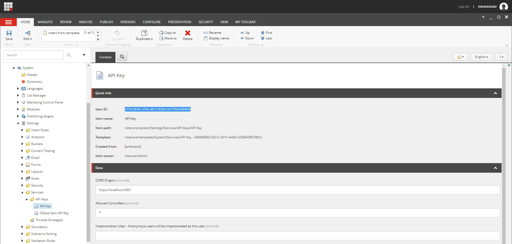

Okay George, you've blabbed a lot in the previous post about what Sitecore headless development is, now how do I get started?

## Easy Mode

Sitecore provides a step-by-step walkthrough on using a provided "Getting Started" sample template to set up an ASP.NET Core rendering host project and Sitecore instance using Docker. I'm not going to copy/paste all that here. [Go follow along with it over there.](https://doc.sitecore.com/developers/100/developer-tools/en/walkthrough--using-the-getting-started-template.html)

Additionally, the Sitecore GitHub account provides an example Helix project that uses the ASP.NET Core rendering host which you can clone and run yourself here: https://github.com/Sitecore/Helix.Examples/tree/master/examples/helix-basic-aspnetcore

> If you want a great video about how all this works, check out [Robbert Hock](https://twitter.com/kayeeNL)'s post here that talks through how that is all set up:
> https://www.kayee.nl/2020/09/29/sitecore-10-headless-development-with-asp-net-core-docker-containers-architecture-overview/

## Hard Mode

What if you're as crazy as I am and wanted to know how to set this up from scratch? What's needed to turn a regular ASP.NET Core MVC application to a Sitecore application with the Sitecore ASP.NET Core SDK? Let's find out!

### Create a New ASP.NET Core Project

Time to create our new blank ASP.NET Core project.

1. Open a terminal window and set your current directory to where you want to create your project.
2. Enter in `dotnet new mvc -n MyProjectName`
3. ???
4. PROFIT!

### Create API Key

For starters, make sure you've installed the [Sitecore Headless Services](https://dev.sitecore.net/Downloads/Sitecore_Headless_Rendering/140/Sitecore_Headless_Rendering_1400.aspx) package in your Sitecore 10 instance.

You'll need to generate an API key for your rendering host to communicate with the Sitecore Layout Service. This can be done directly in the content tree.

Create an item with the template `/sitecore/templates/System/Services/API Key` in the path `/sitecore/system/Settings/Services/API Keys`. Set the value of the `CORS Origins` field to be the URL of your rendering host. It should look something like this:



### Add Additional Configuration Values

This contains the configuration values for the `Startup` class - it's a good idea to separate these out so there's a one-stop shop for modifying them. Additionally, this provides you the ability to set these values at runtime with environment variables!

You'll want to add a `Sitecore` section to your `appsettings.json` file that contains the Sitecore-related values. Here's what you want to put into the root JSON object of the configuration file.

**(Don't just copy/paste this...JSON doesn't have comments so take those out. 😁)**

```json
{
  "Sitecore": {
    // your Sitecore 10 host URL
    "InstanceUri": "https://sitecore10.com",
    // the Sitecore site definition that you are rendering
    "DefaultSiteName": "mysite",
    // the API key that you just created in the previous step
    "ApiKey": "7F3C0F40-37E6-4613-9304-DA7FBA4484E9",
    // the URL of your rendering host (the .NET Core application)
    "RenderingHostUri": "https://localhost:5001",
    // toggle for enabling Experience Editor.
    // You'll want to set this as false in your production "content delivery" instances
    "EnableExperienceEditor": true
  },
  "OtherConfigurations": {
    ...
  }
}
```

### Map Configuration as an Object

The .NET Core configuration library can do some neat stuff, one of which being automatically being able to map your JSON configuration section to a strongly-typed object. First, you need to create your class:

```csharp
public class SitecoreOptions
{
	public static readonly string Key = "Sitecore";

	public Uri InstanceUri { get; set; }
	public string LayoutServicePath { get; set; } = "/sitecore/api/layout/render/jss";
	public string DefaultSiteName { get; set; }
	public string ApiKey { get; set; }
	public Uri RenderingHostUri { get; set; }
	public bool EnableExperienceEditor { get; set; }

	public Uri LayoutServiceUri
	{
		get
		{
			if (InstanceUri == null) return null;

			return new Uri(InstanceUri, LayoutServicePath);
		}
	}
```

Then, in the constructor of your `Startup` class, you'll want to inject the `IConfiguration` service and load in the object:

```csharp
private SitecoreOptions Configuration { get; }

public Startup(IConfiguration configuration)
{
  Configuration = configuration.GetSection(SitecoreOptions.Key).Get<SitecoreOptions>();
}
```

Now you can use that `Configuration` object in your `Startup` class and have the values in the JSON file available to you!

### Service Registrations

There are a number of Sitecore SDK relevant services that need to be registered with the IoC container at application startup. In a typical barebones ASP.NET Core MVC project, you'll have a `ConfigureServices` method in your `Startup.cs` that looks something like this:

```csharp
public void ConfigureServices(IServiceCollection services)
{
  services.AddMvc();
}
```

> Side note: If you're curious of all the permutations of `.AddMvc()`, `.AddMvcCore()`, `.AddControllersWithViews()`, etc., Microsoft describes it here: https://docs.microsoft.com/en-us/aspnet/core/migration/22-to-30?view=aspnetcore-3.1&tabs=visual-studio#mvc-service-registration

Sitecore is going to add in a bunch more services to support the functionality the SDK needs. Fortunately the SDK provides extension methods to make this a little easier. Here's a sample Sitecore ASP.NET Core SDK enabled service registration:

```csharp
public void ConfigureServices(IServiceCollection services)
{
  services
    // Services to support Sitecore's custom routing
    .AddRouting()
    // You must enable ASP.NET Core localization to utilize localized Sitecore content.
    .AddLocalization(options => options.ResourcesPath = "Resources")
    // Basic ASP.NET Core MVC support. The equivalent of .AddControllerWithViews() + .AddRazorPages()
    .AddMvc()
    // At this time the Layout Service Client requires Json.NET due to limitations in System.Text.Json.
    .AddNewtonsoftJson(o => o.SerializerSettings.SetDefaults());

  // Register the Sitecore Layout Service Client, which will be invoked by the Sitecore Rendering Engine.
  services.AddSitecoreLayoutService()
    // Set default parameters for the Layout Service Client from our bound configuration object.
    .WithDefaultRequestOptions(request =>
    {
      request
        .SiteName(Configuration.DefaultSiteName)
        .ApiKey(Configuration.ApiKey);
    })
    .AddHttpHandler("default", Configuration.LayoutServiceUri)
    .AsDefaultHandler();

  // Register the Sitecore Rendering Engine services.
  services.AddSitecoreRenderingEngine(options =>
  {
    // Register your components here. This can also potentially be handled with custom extension methods for grouping or reflection.
    options
      .AddPartialView("Component")
      .AddModelBoundView<ComponentViewModel>("Component")
      .AddViewComponent("ViewComponent")
      .AddDefaultPartialView("_ComponentNotFound");
  })
  // Includes forwarding of Scheme as X-Forwarded-Proto to the Layout Service, so that
  // Sitecore Media and other links have the correct scheme.
  .ForwardHeaders()
  // Enable forwarding of relevant headers and client IP for Sitecore Tracking and Personalization.
  .WithTracking()
  // Enable support for the Experience Editor.
  .WithExperienceEditor(options =>
  {
    // Experience Editor integration needs to know the external URL of your rendering host,
    // if behind HTTPS termination or another proxy (like Traefik).
    if (Configuration.RenderingHostUri != null)
    {
      options.ApplicationUrl = Configuration.RenderingHostUri;
    }
  });

  // Enable support for robot detection.
  services.AddSitecoreVisitorIdentification(options =>
  {
    // Usually the SitecoreInstanceUri is same host as the Layout Service, but it can be any Sitecore CD/CM
    // instance which shares same AspNet session with Layout Service. This address should be accessible
    // from the Rendering Host and will be used to proxy robot detection scripts.
    options.SitecoreInstanceUri = Configuration.InstanceUri;
  });
}
```

### HTTP Request Pipeline

Also in a `Startup.cs` you have a method called `Configure()` which sets up the HTTP request pipeline. The standard ASP.NET Core web app method looks like this:

```csharp
public void Configure(IApplicationBuilder app, IWebHostEnvironment env)
{
  if (env.IsDevelopment())
  {
      app.UseDeveloperExceptionPage();
  }
  else
  {
      app.UseExceptionHandler("/Home/Error");
      app.UseHsts();
  }
  app.UseStaticFiles();

  app.UseRouting();

  app.UseEndpoints(endpoints =>
  {
      endpoints.MapControllerRoute(
          name: "default",
          pattern: "{controller=Home}/{action=Index}/{id?}");
  });
}
```

We'll need to add in a few more lines to process the Sitecore bits of the request pipeline. Here's the sample after it's been Sitecore-ized.

```csharp
public void Configure(IApplicationBuilder app, IWebHostEnvironment env, ILogger<Startup> logger)
{
  if (env.IsDevelopment())
  {
    app.UseDeveloperExceptionPage();
  }
  else
  {
    app.UseExceptionHandler("/Home/Error");
    app.UseHsts();
  }

  // For production content delivery environments, this should not be enabled.
  if (Configuration.EnableExperienceEditor)
  {
    // Enable the Sitecore Experience Editor POST endpoint.
    app.UseSitecoreExperienceEditor();
  }

  app.UseStaticFiles();

  app.UseRouting();

  // Enable ASP.NET Core Localization, which is required for Sitecore content localization.
  app.UseRequestLocalization(options =>
  {
    // If you add languages in Sitecore which this site / Rendering Host should support, add them here.
    var supportedCultures = new List<CultureInfo> { new CultureInfo(defaultLanguage) };
    options.DefaultRequestCulture = new RequestCulture(defaultLanguage, defaultLanguage);
    options.SupportedCultures = supportedCultures;
    options.SupportedUICultures = supportedCultures;

    // Allow culture to be resolved via standard Sitecore URL prefix and query string (sc_lang).
    options.UseSitecoreRequestLocalization();
  });

  // Enable proxying of Sitecore robot detection scripts
  app.UseSitecoreVisitorIdentification();

  app.UseEndpoints(endpoints =>
  {
    // Set default route to error because if a Sitecore route isn't resolved with data, it should display an error page.
    endpoints.MapControllerRoute(
      "error",
      "error",
      new { controller = "Default", action = "Error" }
    );

    // Enables the default Sitecore URL pattern with a language prefix.
    endpoints.MapSitecoreLocalizedRoute("sitecore", "Index", "Default");

    // Fall back to language-less routing as well, and use the default culture (en).
    endpoints.MapFallbackToController("Index", "Default");
  });
}
```

Don't forget to add in the relevant NuGet packages that are required for the SDK. Your `.csproj` file should look something like this:

```xml
<Project Sdk="Microsoft.NET.Sdk.Web">
  <PropertyGroup>
    <TargetFramework>netcoreapp3.1</TargetFramework>
  </PropertyGroup>
  <ItemGroup>
    <PackageReference Include="Microsoft.AspNetCore.Mvc.NewtonsoftJson" Version="3.1.7" />
    <PackageReference Include="Microsoft.Extensions.DependencyInjection.Abstractions" Version="3.1.7" />
    <PackageReference Include="Microsoft.Extensions.Http" Version="3.1.7" />
    <PackageReference Include="Sitecore.LayoutService.Client" Version="14.0.1" />
    <PackageReference Include="Sitecore.AspNet.RenderingEngine" Version="14.0.1" />
    <PackageReference Include="Sitecore.AspNet.ExperienceEditor" Version="14.0.1" />
    <PackageReference Include="Sitecore.AspNet.Tracking" Version="14.0.1" />
    <PackageReference Include="Sitecore.AspNet.Tracking.VisitorIdentification" Version="14.0.1" />
  </ItemGroup>
</Project>
```

That should be it for setup! Now you're ready to create some components! (finally!)
