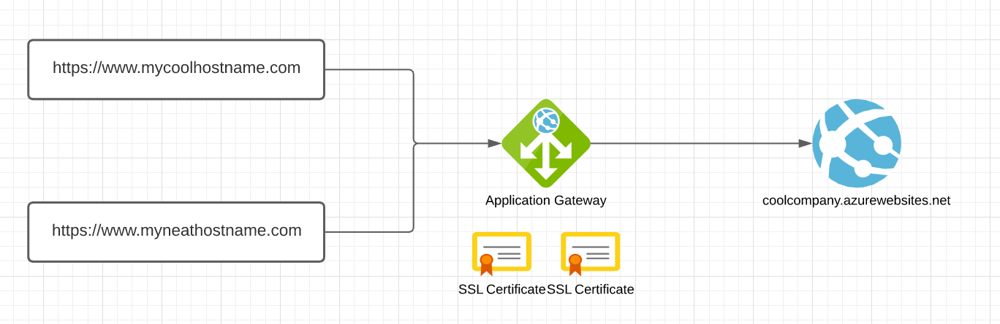

## The Setup

> - Multisite Sitecore instance on Azure App Service
> - Application Gateway manages the SSL certificates

Here's the sitch. We've got a multisite Sitecore instance with the following URLs:

- https://www.mycoolhostname.com
- https://www.myneathostname.com

The Sitecore instance is deployed to Azure App Services and behind an Application Gateway with a static IP address. The hostnames have A records pointing to this static IP address. The Application Gateway has these hostnames configured as the frontend IPs and associated listeners have been attached.

The SSL certificates for HTTPS is configured directly on the application gateway and we want to avoid having to manage the SSL certificate on both the application gateway and the app services. Unfortunately, this isn't really SSL termination at the application gateway since you're still using SSL to get to the app service. Not much you can do about that unfortunately.

The Sitecore app service is set as the backend with the URL https://coolcompany.azurewebsites.net.



We would expect that https://www.mycoolhostname.com and https://www.myneathostname.com would route through the application gateway and be able to use this hostname to resolve the context site based on its Sitecore site definition. Since you're reading this, that's obviously not happening. 😁

## The Problem

> The Application Gateway makes a request to the App Service with its URL which is going to be the same no matter what the originally requested URL was.

By wanting to keep the management of the SSL certificates strictly on the application gateway and not have to add the custom domain/SSL certificates onto the app services themselves, the application gateway integrates with app services quite well in that it can automatically set the appropriate headers based on the app service selected.

The problem, however, is that once the request hits the application gateway, the application gateway rewrites the request to the backend app service - that is, the application gateway makes a request to the app service using the `*.azurewebsites.net` URL. This is generally okay in a single-site scenario, but with Sitecore and supporting multisites, Sitecore uses the host header to determine which site to resolve to.

The application gateway reroutes traffic to the backend service using the hostname of the service, which makes sense as something like an app service is effectively a load balancer. However, this causes problems since regardless of the incoming URL, whether it's `www.mycoolhostname.com` or `www.myneathostname.com`, the host that is contacted on the backend is always `coolcompany.azurewebsites.net`.

The Azure Application Gateway tries to solve for this (as many load balancers do) by forwarding the requested hostname as a separate header for the application to use. Somewhat annoyingly, Azure Application Gateway uses the `X-ORIGINAL-HOST` header to pass along the original request hostname rather than the traditional `X-FORWARDED-HOST`. Additionally, the application gateway service _does_ provide header rewrite functionality, however, it won't let you rewrite the host header of a rule that has a multisite listener which somewhat defeats the purpose. No matter - we press forward!

## The Goal

> Have Sitecore use the correct URL to resolve the context site.

So we know what we want - we want the original request URL as the host header for the request coming into Sitecore so Sitecore can use that to resolve the site by matching the `hostName` property in the site definition.

More recent versions of Sitecore ship with an example config file called `Sitecore.LoadBalancing.config.example` used for SSL offloading which I secretly hoped, when enabled, would use the specified header to resolve the site. Alas, that was not the case - this setting only provides functionality to specify the header to use with the `LinkManager` (which is also important) but doesn't provide the ability to specify the header to resolve your site. The Sitecore site resolution depends on the host header of the incoming request.

Yes, a more brutish approach was needed. We know we have the `X-Original-Host` header, now how do we get that to be the host header?

## The Execution

> Update the `HTTP_HOST` server variable to be the value of the `X-Original-Host` header instead of the host header that comes along as part of the HTTP response.

We're going to lean on our old friend IIS URL Rewrite which is conveniently available on app services. However, we need to do a little bit of tweaking.

In order to modify server variables with URL Rewrite, you first have to basically whitelist the variables you want to alter. In this case, we want to change the `HTTP_HOST` server variable since that's the one that ASP.NET retrieves the `HttpRequest.Url` property from.

To do so, we need to update `applicationHost.config` on the IIS server. You're now thinking, "But wait George, this is an app service! I can't get to its `applicationHost.config` file! Security and stuff!" Well, turns out [our friends at the Kudu project already thought of this and provide a way to transform](https://github.com/projectkudu/kudu/wiki/Xdt-transform-samples) the `applicationHost.config file at runtime with this file: `D:\home\site\applicationHost.xdt`. If the file doesn't already exist, you can create it through the Kudu interface.

Pop open that file and put in the following config transformation to add the `HTTP_HOST` server variable to the list that can be modified:

```xml
<?xml version="1.0" encoding="utf-8"?>
<configuration xmlns:xdt="http://schemas.microsoft.com/XML-Document-Transform">
  <system.webServer>
    <rewrite>
      <allowedServerVariables>
        <add name="HTTP_HOST" xdt:Transform="InsertIfMissing" />
      </allowedServerVariables>
    </rewrite>
  </system.webServer>
</configuration>
```

Now that's all done, we need to update our Web.config file. Since you're doing cool Sitecore things and you want to minimize any pain in doing any upgrades, you're using transforms to modify the stock `Web.config` file. You ARE using transforms, aren't you?

Here's the transform to add the rewrite rule to read the `HTTP_X_ORIGINAL_HOST` server variable (which contains the value of the `X-Original-Host` header) and set its value to be the value of the `HTTP_HOST` variable.

```xml
<?xml version="1.0" encoding="utf-8"?>
<configuration xmlns:xdt="http://schemas.microsoft.com/XML-Document-Transform">
  <system.webServer>
    <rewrite>
      <rules>
        <rule name="Set value of HTTP_HOST to value of X-ORIGINAL-HOST header" xdt:Transform="InsertIfMissing">
          <match url="(.*)"></match>
          <conditions logicalGrouping="MatchAll" trackAllCaptures="false">
            <add input="{HTTP_X_ORIGINAL_HOST}" pattern="^$" negate="true" />
          </conditions>
          <serverVariables>
            <set name="HTTP_HOST" value="{HTTP_X_ORIGINAL_HOST}"></set>
          </serverVariables>
        </rule>
      </rules>
    <rewrite>
  </system.webServer>
</configuration>
```

After making those modifications, you'll want to restart your Kudu application to ensure that the `applicationHost.xdt` transform takes since it transforms at startup - do this by going to `Site extensions` in the top navigation of the Kudu portal of your site (https://whateveryoursiteis.scm.azurewebsites.net) and click on the `Restart Site` button on the right.

You should also restart your app service to be safe. You can do this via the Azure CLI or the Azure Portal.

## The Result

> The original request URL is set as the host header which Sitecore then uses to determine the context site.

I created a super basic web forms page to put in `/sitecore` to see the results of the various headers and server variables that are coming through. That page looks like this:

```html
<%@ Page Language="C#" AutoEventWireup="true" %>

<!DOCTYPE html>

<html>
  <head runat="server">
    <title>Headers</title>
  </head>
  <body>
    <form id="form1" runat="server">
      <div>
        <p>HTTP_HOST: <%=Request.ServerVariables["HTTP_HOST"]%></p>
        <p>
          HTTP_X_ORIGINAL_HOST:
          <%=Request.ServerVariables["HTTP_X_ORIGINAL_HOST"]%>
        </p>
      </div>
    </form>
  </body>
</html>
```

Now, I can go to `https://www.mycoolhostname.com/sitecore/headers.aspx` and see the info to troubleshoot. Before making the modifications above, it looked like this:

```
HTTP_HOST: coolcompany.azurewebsites.net

HTTP_X_ORIGINAL_HOST: www.mycoolhostname.com
```

After the modifications, the page looked like this:

```
HTTP_HOST: www.mycoolhostname.com

HTTP_X_ORIGINAL_HOST: www.mycoolhostname.com
```

Since the `HTTP_HOST` server variable has been rewritten, ASP.NET takes this as its `HttpRequest.Url` and Sitecore then uses this value to determine the context site from the `hostName` attribute in the site definition.

If your site definition looked like this:

```xml
<configuration xmlns:patch="http://www.sitecore.net/xmlconfig/">
  <sitecore>
    <sites>
      <site name="mycoolhostname" patch:before="site[@name='website']" hostName="www.mycoolhostname.com" virtualFolder="/" physicalFolder="/" rootPath="/sitecore/content/Cool" startItem="/home" ... />
      <site name="myneathostname" patch:before="site[@name='website']" hostName="www.myneathostname.com" virtualFolder="/" physicalFolder="/" rootPath="/sitecore/content/Neat" startItem="/home" ... />
    </sites>
  </sitecore>
</configuration>
```

Now going to https://www.mycoolhostname.com will use the SSL certificate on the application gateway but still route you to `/sitecore/content/Cool/Home` and https://www.myneathostname.com will route you to `/sitecore/content/Neat/Home`. Cool, right? Pretty neat.
