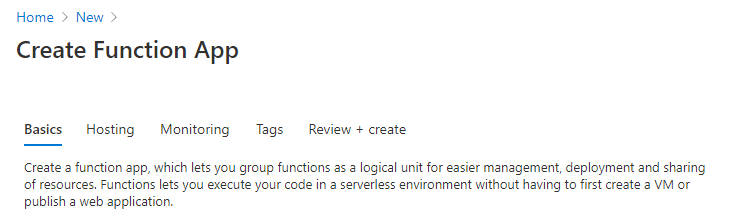
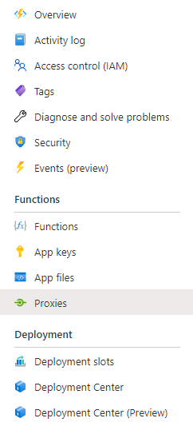
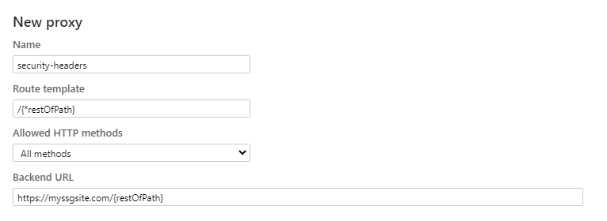
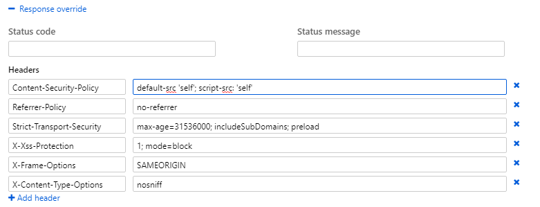

If you haven't been paying attention in the internet world in the past year or so, **static site generation** (a.k.a. SSG) is the new hotness!

## Static Site Generation

So what exactly is static site generation anyways? Well, back in the olden days, we used to write HTML by hand. Like, we actually typed out `<html>` and stuff in Notepad or something. This all went in a `.html` file and put on a web server somewhere and then the internets could browse to it. Think of SSG as code-gen for this process. Take some templates and some content, run it through a process, output some `.html` files to put on a web server. We've come full-circle. 😄

Do you know what that web server doesn't need? Node. ASP.NET. PHP. Any other server-side processing. There's no processing, just serving up some straight up HTML files. So, you can imagine, it's FAST. Now that we have CDNs that can bring those files to the edge, it can now be super fast anywhere in the world.

There's just one problem though: if you don't need the overhead of a full-blown web server with server-side processing, you lose a lot of the benefits that they bring as well - one of which is security headers.

## Security Headers

[Security headers](https://securityheaders.com) dictate what your site can and cannot do - for example, it can say your site can only load CSS from your domain or only images for your domain and a domain for your DAM or you have to require HTTPS to access the site - stuff that prevent someone from hijacking your site for nefarious purposes. These headers come through as part of the response from the web server when delivering your page. If you don't have a robust web server to be able to configure these headers, what can you do?

## Azure to the rescue!

Azure Functions has this cool feature called [proxies](https://docs.microsoft.com/en-us/azure/azure-functions/functions-proxies). You can set a proxy to be handle some basic stuff like rewrites or header manipulation - it's a layer you can configure in the portal (which under the covers is actually just configured in a `proxies.json` file next to your `hosts.json` file). There's no code you have to deal with or anything, and since Azure Functions can be consumption-based, you're only paying for the requests that go through this proxy. In addition, you can proxy a function so instead of https://functionapp.azurewebsites.net/api/functionname you can rewrite it to be https://functionapp.azurewebsites.net/dostuff or something.

> Proxies are the facemasks of your web presence. Wear a mask and wear it properly!

What we're interested in though here is adding security headers. The ones we're interested in (and the ones that are checked on `https://securityheaders.com`) are the following:

- `Strict-Transport-Security`
- `Content-Security-Policy`
- `X-Frame-Options`
- `X-Content-Type-Options`
- `Referrer-Policy`
- `Permissions-Policy`

Depending on how you're hosting your SSG site, your hosting provider may already be providing some of these headers out of the kindness of their hearts. We're going to assume you're starting with nothing.

## Make Azure Magic

First, you'll want to create yourself a function app in Azure.



You can then create the proxy with clicky GUI mode or hardcore text mode or a mix of both. They'll all result in the same thing.

### GUI Mode

In the Azure Portal, go to your function app and click on the `Proxies` menu item on the left. Create a new proxy by clicking the `+ Add` Button on the top of the `Proxies` screen.



Give your proxy a name (mine is called `security-headers`) and fill in the remaining fields. In this situation, I'm intercepting all requests from the root - this is where the `/{*restOfPath}` is needed then I reattach the `{restOfPath}` onto your backend URL, which is the URL of your SSG site.



Then, expand the `Response override` panel and you'll find a section for `Headers`. This where you can override what headers get returned in addition to what your own site is returning. Here are those same 6 security headers we saw earlier.



Hit `Save` at the top and your proxy is ready! This will create a `proxies.json` file with all your settings at the root of your function app.

### Text Mode

I see that you too are not the GUI fan. Well, fortunately for you, the proxy itself is no more than a JSON file that sits at the root of your function app. Here's what those 6 security headers look like in the `proxies.json` file.

#### proxies.json

```json
{
  "$schema": "http://json.schemastore.org/proxies",
  "proxies": {
    "security-headers": {
      "matchCondition": {
        "route": "/{*restOfPath}"
      },
      "backendUri": "https://myssgsite.com/{restOfPath}",
      "responseOverrides": {
        "response.headers.Content-Security-Policy": "default-src 'self'; script-src: 'self'",
        "response.headers.Referrer-Policy": "no-referrer",
        "response.headers.Strict-Transport-Security": "max-age=31536000; includeSubDomains; preload",
        "response.headers.X-Xss-Protection": "1; mode=block",
        "response.headers.X-Frame-Options": "SAMEORIGIN",
        "response.headers.X-Content-Type-Options": "nosniff"
      }
    }
  }
}
```

Put that in your app service with your favorite deployment method - FTP, Kudu, App Service Editor, whatever - and you're all set!

## Putting it all together

Now your function app with its `azurewebsites.net` URL is returning your site with the correct security headers, you can point your domain directly to that with a CNAME. This can be handled with your domain registrar but once that's set then any URLs that come through will get that list of security headers attached as part of that response.

Bon appétit! (but securely)
